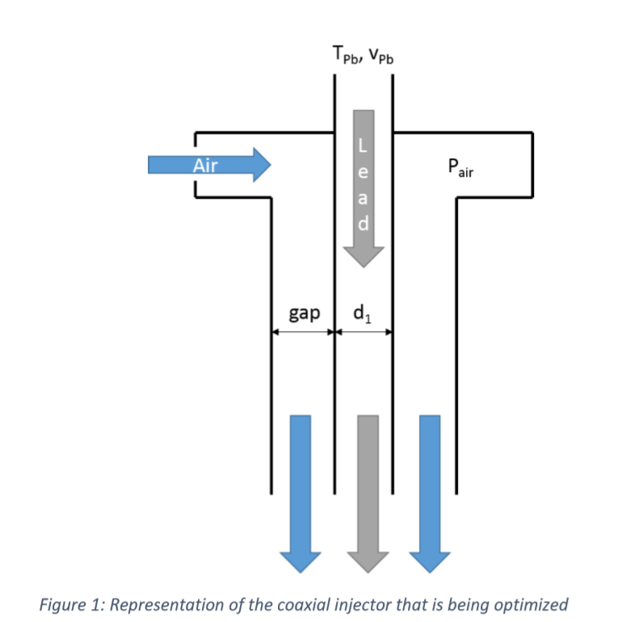
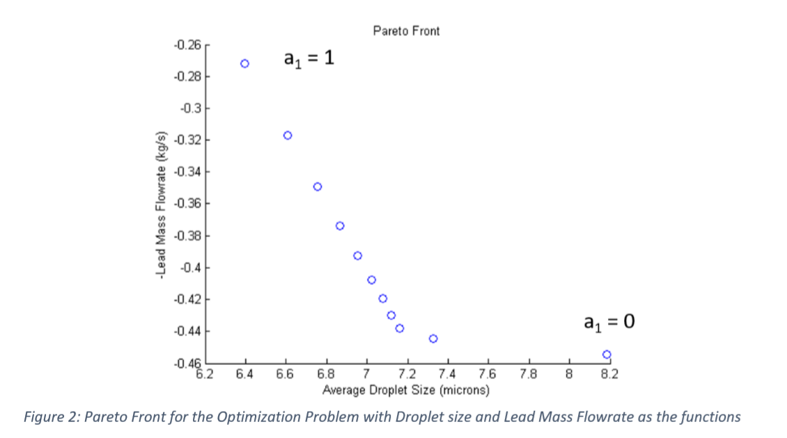
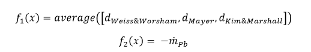
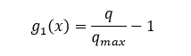
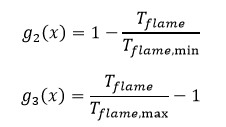
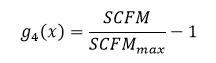
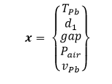
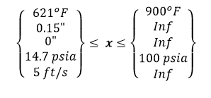
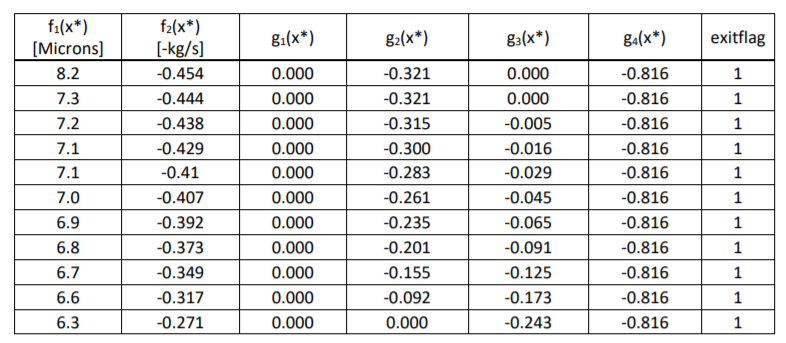
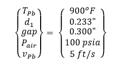

# Coaxial Injector Optimization
Code for optimization of fuel flowrate and droplet size of a coaxial injector (Combination of Master's research project and AAE 550 final report)

The current method for making lead oxide hasn’t been improved significantly in the past decade.  The research project that I am working on is to design a coaxial injector using lead as the fuel, and air as the oxidizer to create lead oxide.  A coaxial injector works by having concentric cylinders, with the liquid (lead in this case) travelling through the center cylinder, and high velocity gas (air in this case) flowing through the annulus.  When the high velocity gas contacts the low velocity liquid, the shear stress and the Helmholtz instability causes the liquid to atomize. A representation can be seen in Figure 1. 
 

There are two main functions that we are trying to minimize/maximize.  We want to minimize the droplet size and maximize the mass flowrate of lead.    Intuitively, these two functions are competitive and to get a better idea, a Pareto front needs to be constructed.  We have control of 5 different design variables: Temperature of the lead, diameter of the center cylinder (for lead), gap of the annulus (for air), total pressure of the air, and velocity of the lead.  The droplet size is calculated taking the mean of three empirical formulas.   

There are four main constraints for this problem.  First, the air must be heated to 6000F for the reaction to occur, but the heater has a power limitation of 70 kW, so the mass flow rate of the air must be limited so that the heater can heat all of the air to 6000F.  The second and third constraints are that the flame temperature must be hotter than 1628oF so that lead oxide can be created, but it must be less than 2300oF so that the combustion tube doesn’t melt.  The flame temperature is driven by the O/F ratio and the temperatures of the lead and air.  The final constraint is that the pump to pressurize the air has a maximum SCFM (maximum volumetric flowrate) of 2200.  There are lower and upper bounds for some of these design variables that will be shown later. 

For the individual optimizations, I used the SQP method using Matlab’s fmincon with numerical gradients.  I chose this method because the problem is highly nonlinear with four nonlinear constraints, continuous design variables, and no analytical gradients available, and SQP is the easiest to implement and best method for this case.  In addition, for the Pareto front, I chose Min-Max approach because I wanted to be able to see if there were any convex points and because of the ease of implementation. 

Problem Formulation 
The droplet size function and mass flowrate function, can be written as the following, respectively: 

The air heater power constraint can be written as: 

The minimum and maximum flame temperature can be written as: 

Finally, the air pump SCFM limit can be written as:

The design variables are defined as the following: 

With the following lower and upper bounds: 

The main script (SQP.m) first solves for the minimum f1(x) and then for the minimum f2(x) independently, subject to the four constraints.  Then a new variable is added Β, (x6), and this becomes the new objective function.  The other two functions are put in as new constraints, and are slightly modified into a 𝜙 function using the minimum values calculated earlier, and are multiplied by a1 and a2, respectively, and set less than Β.  This solution is then minimized to solve for x*, and the original f1(x) and f2(x) are solved and saved.  The main script then does this for multiple values of a, and the corresponding x*, f1(x*), and f2(x*) values are saved.  A graph and table of the results can be seen in Figure 2 and Table 1, below. 

From the table and graph, it can be seen that from a1 = 0 to about a1 = 0.2, there is a large decrease in the average droplet size, while having a minimal effect on the lead mass flowrate.  For the region a1 = 0.2 to a1=1, there is a significant decrease in the lead mass flowrate (increase in f2), while having a minimal effect on the average droplet size.  Because of these facts, the point at which a1 = 0.2 and a2 = 0.8 seems like the best design for a large lead mass flowrate and small droplet sizes. 

In addition, looking at the x* values, we can see that the fourth and fifth design variables (Air pressure and Lead velocity) do not change.  We can also see that the first constraint (heater power) is always active, whereas the second and third, the minimum and maximum flame temperature constraints, are only active in the beginning and end, respectively.  The fourth constraint, the SCFM limitation, is never near being active.  This is because the first constraint limits the mass flow rate of the air, and since that constraint is activated first, the fourth constraint is never active. 

Finally, we can see that the exitflags for all of the optimizations is 1, which means that the algorithm was able to find a minimum.  There were also no convex points in this optimization so weighted sum method would have also worked, but it was good to start with Min-Max to make sure that there weren’t any convex points. 

In conclusion, using the Min-Max method for the Pareto front and the SQP method for individual optimization (fmincon in Matlab), we were able to plot the Pareto front.  Using this visualization of the Pareto front, along with the table, we were able to select the following design for the injector.  

 
